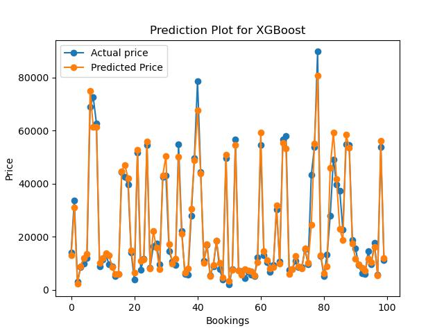
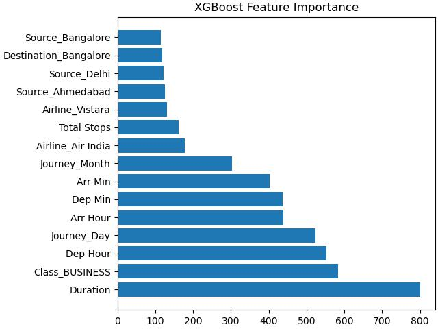

# Flight Price Prediction using XGBoost Regression

## Overview
1. This **Machine Learning project** is built in **Python** using **Jupyter Notebook** to **Predict flight prices** for flights traveling across **major cities in India**.
2. The **dataset** is **scrapped** and it requires huge **data cleaning** which is done using **ReGex, Pandas** and **Numpy.**
3. **Sklean XGBoost Regressor model** is used for **Prediction.**

## EDA and Feature Engineering

### We used RegEx, Pandas and Numpy together to clean the dataset and some created new features using it

1. Extract Airline from Airline-Class
2. Extract Class from Airline-Class
3. Extract Source from Departure Time	
4. Extract Departure Hour and Min from Departure Time
5. Extract Destination from Arrival Time
6. Extract Arrival Hour and Min from Arrival Time
7. Convert Duration time in minutes
8. Convert Date of Journey into 2 separate features Journey Day and Journey Month
9. Convert Date of Booking into 2 separate features Booking Day and Booking Month

## Handling Categorical Data

Please refer to this nice [article](https://towardsdatascience.com/handling-categorical-data-the-right-way-9d1279956fc6) on how to handle Categorical Data

### One-Hot Encoding
One-Hot Encoding is the most common, correct way to deal with non-ordinal categorical data. It consists of creating an additional feature for each group of the categorical feature and marking each observation belonging (Value=1) or not (Value=0) to that group. 

#### We used One-Hot Encoding for Airline, Class, Source and Destination feature.

### Label Encoding
One of the simplest and most common solutions advertised to transform categorical variables is Label Encoding. It consists of substituting each group with a corresponding number and keeping such numbering consistent throughout the feature.

#### We used Label Encoding for Total stops feature.

## Model fitting using XGBoost 

#### For the Regression model, evaluation should be done using Mean Absolute Percentage Error

1. Split the dataset into train and test sets.
2. XGBoost does not require any feature scaling.
3. Check for important features.
4. Import and fit the model.
5. Evaluate the loss on mean square error.
6. Predict for test data.
7. Evaluate the mean absolute percentage error between y_test and y_pred.
8. Plot the first 100 samples from y_test and y_pred.

## Model Performance

**Percentage Accuracy for Test data is 85.64 %**

**Mean Absolute Percentage Error for Test data is 14.36 %**

## Results for 100 booking prices - Actual Price and Predicted Price

## Feature Importance

